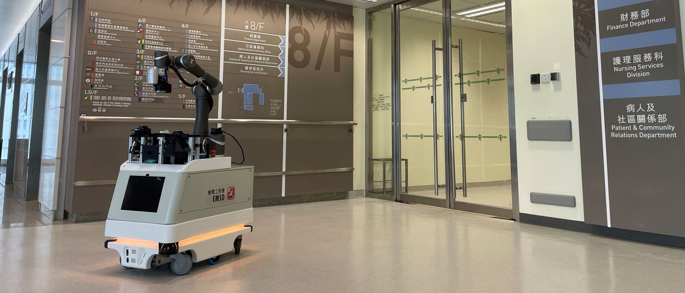

# W0303 Overview

## Introduction

[Onsite Trial Video - 1](https://youtu.be/3_yQ5s5oSw4) | [Onsite Trial Video - 2](https://youtu.be/yljeNZbJ-PU) | [Onsite Trial Video - 3](https://youtu.be/IBontb4xmpU)

**This program aims to:**

1. Establish a control system which can control mobile manipulator to handle cleaning & disinfection tasks.
2. Interact with [Web-based GUI](https://robot.willsonic.com/) via database(MSSQL). (not release to public. [Screenshot - 1](doc/resources/screenshot_publish_schedule.png) | [Screenshot - 2](doc/resources/screenshot_job_record.png))
3. Perform Vision Algorithms(Point Cloud / QR Code) to adjust localization error caused by mobile robot.

**The control system consists of several modules, including:**

1. Schedule Module: system entry module, interacting with other modules.
2. Arm Module: motion control module & status manager for robotic arm([tm5-900](https://www.tm-robot.com/en/regular-payload/)).
3. Ugv Module: motion control module & status manager for mobile robot([mir100](https://www.mobile-industrial-robots.com/solutions/robots/mir100/)).
4. Database Module: detailed functions implementation.
5. Vision Module: point cloud/2d image processing module.
6. Algorithms Module: robotic arm TCP transformation/ motion path generation module.

## Installation

**Prerequisite**

1. Language: C++
2. Compiler: Cmake
3. CPU Architecture: x64
4. Package Manager: Vcpkg
5. Libraries: opencv4/nanodbc/glog/libmodbus/poco/eigen3/boost/pcl/openni2

## Usage

## Contributing

## License